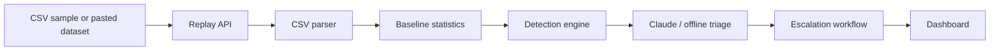

# trade-sentinel
AI-Powered Trade Surveillance &amp; Alert Triage Platform


# Trade Sentinel

Spring Boot trade surveillance and AI alert triage demo for the Wissen Technology Hackathon 2026 problem statement.

## What It Demonstrates

- CSV ingestion and replay of order/trade events.
- Three suspicious-pattern detectors:
  - Layering / spoofing
  - Wash trading
  - Momentum ignition / price spike manipulation
- Claude-powered triage when `ANTHROPIC_API_KEY` is configured.
- Deterministic offline triage fallback for reliable demos.
- False-positive reasoning, confidence scoring, case notes, and recommended actions.
- Automated workflow actions: compliance case, notification, watchlist update, analyst task, and audit log.
- A no-build browser dashboard served by Spring Boot.

## Architecture



## Run

```powershell
.\gradlew.bat bootRun
```

Open:

```text
http://localhost:8080
```

Build a runnable jar:

```powershell
.\gradlew.bat clean bootJar
java -jar build\libs\trade-sentinel-0.0.1-SNAPSHOT.jar
```

## Claude API Key

The app works without a key in offline triage mode. To enable Claude triage:

```powershell
$env:ANTHROPIC_API_KEY="sk-ant-..."
.\gradlew.bat bootRun
```

Optional model override:

```powershell
$env:ANTHROPIC_MODEL="claude-3-5-sonnet-latest"
```

## Demo Script

1. Open the dashboard and click `Run Replay`.
2. Show the summary queue: 37 events, 3 alerts, escalated workflow actions.
3. Open the layering alert and point to cancellation ratio, median cancel time, and opposite-side fills.
4. Open the wash trading alert and show repeated buy/sell cycles with matched quantities.
5. Open the momentum ignition alert and show short-window price impact.
6. Explain the triage block: verdict, confidence, false-positive probability, risk factors, false-positive checks, case note.
7. Show workflow automation: case ownership, priority, SLA, notification, and watchlist.

## Scoring Rubric Mapping

- AI Triage Quality: structured Claude prompt, offline parity, case note, false-positive factors.
- Pattern Detection: three detectors with severity and evidence.
- Automation & Workflow: case, notification, watchlist, analyst task, audit trail.
- Working Demo: self-contained replay and dashboard.
- API Efficiency: one Claude call per generated alert, compact JSON prompt, offline fallback.
- Docs: README plus `docs/API.md` and `docs/HACKATHON_PLAYBOOK.md`.

## API

- `GET /api/health` returns runtime status and whether Claude is configured.
- `GET /api/sample` returns bundled sample CSV.
- `POST /api/replay` accepts JSON with `csv` and optional `replayDelayMs`.

See [docs/API.md](docs/API.md) for response shapes.

## CSV Schema

Required columns:

```csv
order_id,trader_id,account_id,symbol,exchange,side,quantity,price,event_type,event_time
```

Allowed `event_type` values:

```text
NEW, MODIFY, CANCEL, EXECUTE
```

`event_time` should be ISO-8601:

```text
2026-06-06T10:00:00.000Z
```

## Test

```powershell
.\gradlew.bat test
.\gradlew.bat bootJar
```

## Known Limits

- No real exchange feed, Kafka, database, Slack, Jira, or case-management integration.
- Baselines are computed from replay data, not a historical 30-day warehouse.
- Offline triage is deterministic and demo-safe; Claude triage requires network and a valid API key.

How to Run


Option 1 — Gradle (recommended)


cd D:\Hackathon\trade-sentinel
.\gradlew.bat bootRun


Option 2 — Fat JAR


cd D:\Hackathon\trade-sentinel
.\gradlew.bat bootJar
java -jar build\libs\trade-sentinel-0.0.1-SNAPSHOT.jar


Default port: http://localhost:8080
Dashboard: Open http://localhost:8080 in a browser — interactive UI included.


Optional env var (enables Claude AI triage; offline fallback used if absent):
$env:ANTHROPIC_API_KEY = "sk-ant-..."


---
All Endpoints


┌────────┬──────────────────┬──────────────────────────────────────────────────────────┐
│ Method │     Endpoint     │                       Description                        │
├────────┼──────────────────┼──────────────────────────────────────────────────────────┤
│ GET    │ /                │ Interactive dashboard (HTML — open in browser)           │
├────────┼──────────────────┼──────────────────────────────────────────────────────────┤
│ GET    │ /api/health      │ Runtime status + whether Claude is configured            │
├────────┼──────────────────┼──────────────────────────────────────────────────────────┤
│ GET    │ /api/sample      │ Returns the built-in sample CSV for copy-paste           │
├────────┼──────────────────┼──────────────────────────────────────────────────────────┤
│ GET    │ /api/sample-json │ Returns the 103-order JSON dataset                       │
├────────┼──────────────────┼──────────────────────────────────────────────────────────┤
│ POST   │ /api/replay      │ Full pipeline from CSV body → detect → triage → escalate │
├────────┼──────────────────┼──────────────────────────────────────────────────────────┤
│ POST   │ /api/replay-json │ Full pipeline from JSON body (surveillance format)       │
└────────┴──────────────────┴──────────────────────────────────────────────────────────┘


---
Endpoint Details


GET /api/health
{"ok": true, "claudeConfigured": true}


POST /api/replay — body: {"csv": "..."} or {} (uses sample)


POST /api/replay — body: {"csv": "..."} or {} (uses sample)
{
  "summary": {
    "eventsIngested": 37,
    "alertsGenerated": 3,
    "highSeverity": 3,
    "escalated": 3,
    "review": 0,
    "ignored": 0,
    "triageSource": "claude"
  },
  "alerts": [
    {
      "alert": { "alert_id": "A-0001", "pattern": "Layering / Spoofing",
                 "trader_id": "T-4821", "symbol": "HDFCBANK",
                 "severity": "HIGH", "score": 99 },
      "triage": { "verdict": "ESCALATE", "confidence": 96 }
    }
  ],
  "escalations": [
    { "alertId": "A-0001", "actions": [
      { "type": "CASE_CREATED", "owner": "Surveillance Desk L2", "priority": "P1", "sla": "2 hours" },
      { "type": "NOTIFICATION", "target": "compliance-ops", "sla": "15 minutes" },
      { "type": "WATCHLIST_UPDATE", "target": "T-4821", "sla": "72 hours" }
    ]}
  ]
}


POST /api/replay-json — body: JSON with "orders": [...] array
- Detected the 2 planted patterns from the 103-order dataset:
  - A-0001 — Layering/Spoofing — T-1042 / HDFCBANK (score 99)
  - A-0002 — Spoofing — T-1087 / RELIANCE (score 95) ← new detector from surveillance merge


GET /api/replay bad input → structured error
{"error": "Missing CSV columns: order_id, trader_id, ..."}


---
Detected Pattern Types


┌────────────────────────┬──────────────────────────────────────────────────────────────────────────────┐
│        Pattern         │                                   Trigger                                    │
├────────────────────────┼──────────────────────────────────────────────────────────────────────────────┤
│ Layering / Spoofing    │ ≥6 large orders (qty ≥25k) with cancel ratio ≥70% and median cancel time     │
│                        │ ≤1500ms                                                                      │
├────────────────────────┼──────────────────────────────────────────────────────────────────────────────┤
│ Spoofing               │ Single order ≥5× trader baseline, cancelled ≤2s, no fill                     │
│ (single-order)         │                                                                              │
├────────────────────────┼──────────────────────────────────────────────────────────────────────────────┤
│ Wash Trading           │ ≥3 buy↔sell execution cycles within 60s with <15% size delta                 │
├────────────────────────┼──────────────────────────────────────────────────────────────────────────────┤
│ Momentum Ignition      │ ≥5 same-side executions with ≥1% price move and ≥30k qty in 90s              │
└────────────────────────┴──────────────────────────────────────────────────────────────────────────────┘